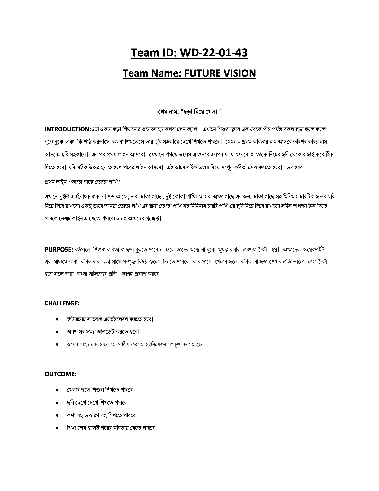
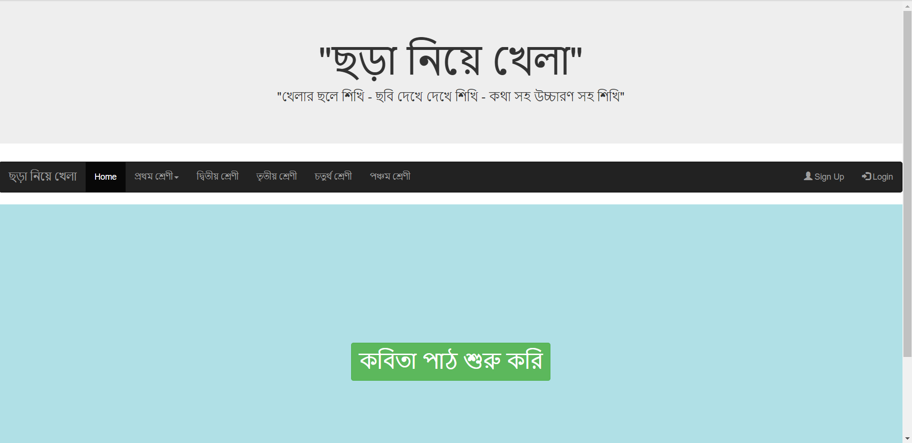
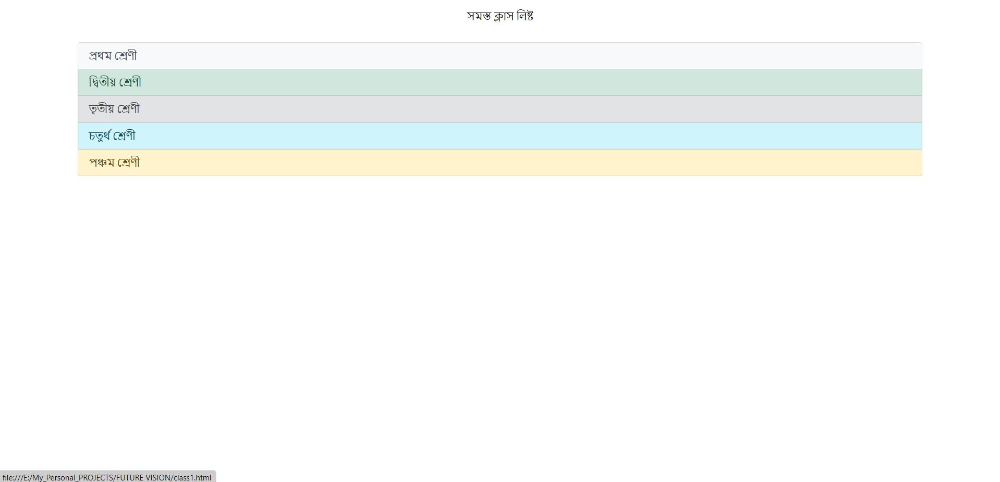
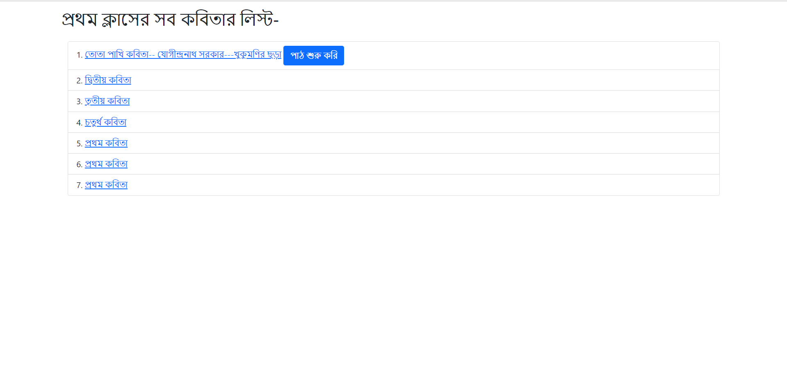
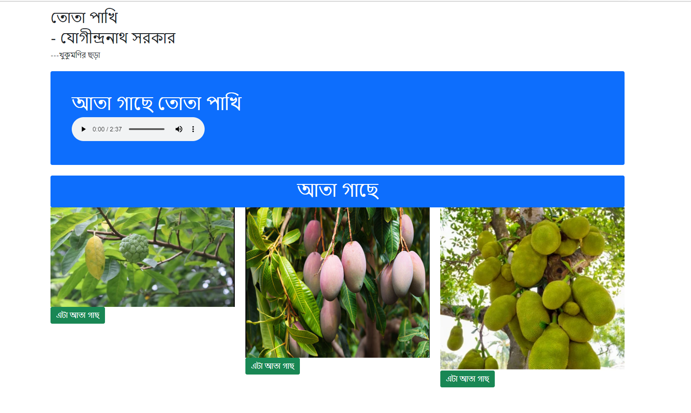
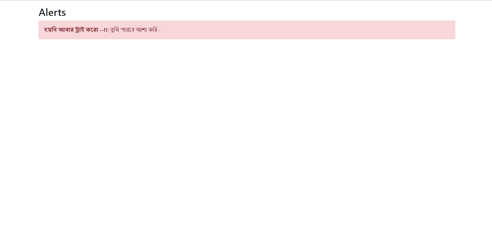
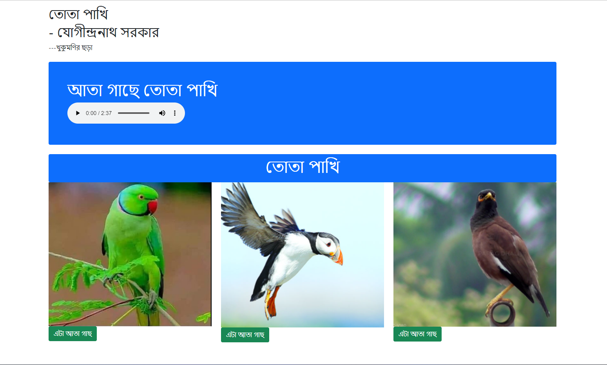
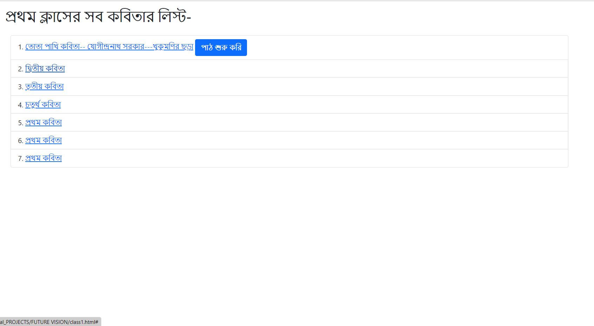

# ***DIU website development contest- 2022***
# -----------------------------Childpoem
## ⛳Website Development Contest- 2022-organized by kkhudeghor supported By CSE Department at DIU.
# 🎗️Achievement: First place in the Competition.
## 💡গেম নাম: “ছড়া ননয়ে গেলা “

# About for this contest: 

# Project View:
----
- Home page of website:
    

- কবিতা পাঠ শুরু করি :
    

- কবিতা বাছাই করি  :
    

- প্রথমে কবিতা অডিও শুনি তারপর সঠিক ছবি বাছাই করি :
    

- ছবি বাছাই ভুল হয়েছে:
    

- সঠিক টা আবার বাছাই করি :
    

- সঠিক হয়েছে :
    

- পরের কবিতাটা শিখে ফেলি :
    

----- 

### THANKS- 🐧 
## ☑️Contact: [GitHub](https://github.com/Raju-Mia)